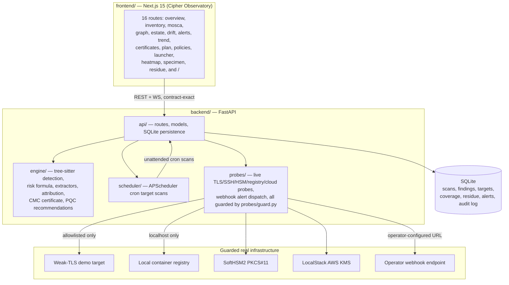

# ECDAT — Enterprise Cryptographic Discovery & Analysis Tool (SIH26164)

[](#security--air-gap-invariants)
[](contracts/openapi.yaml)
[](#measured-verification-results)
[](#measured-verification-results)
[](CHANGELOG.md)

**ECDAT** is an air-gapped cryptographic discovery, quantum-risk scoring, and PQC migration platform: it scans source code, binaries, and running infrastructure for cryptographic assets, scores their quantum risk against Mosca's inequality, recommends post-quantum replacements, and exports a CycloneDX 1.6 Cryptographic Bill of Materials (CBOM).

**v1.0.0** adds the capability no competitor has: **Crypto Mass Conservation (CMC)**. The tool now reports what it could *not* explain. Every scan carries a **Coverage Certificate** and a **Debt Ledger of Residue Clusters**. Unmodelled or proprietary crypto is never swept under the rug — it is reported with exact byte/source ranges and can be operated (promoted to rules, excluded with justification + owner, or accepted).

**Documentation**: [`docs/README.md`](docs/README.md) is the index — architecture, install, operations, API reference, benchmark protocol, security, and a Q&A pack, each with real dated numbers and the exact commands that produced them.

---

## Architecture

See [`docs/ARCHITECTURE.md`](docs/ARCHITECTURE.md) for the full component diagram, data flow, and module ownership map. Summary:



`contracts/openapi.yaml` is the single source of truth for the API shape; both the backend's generated OpenAPI and the frontend's generated TS types are checked against it with zero drift.

---

## Key Capabilities

1. **Multi-surface, multi-language detection engine** — tree-sitter AST queries for Python, Java, Go, C/C++, Rust, and C#; PE/Mach-O binary constant inspection (e.g. stripped-binary AES S-box tables); PEM/DER certificate parsing.
2. **Crypto Mass Conservation (CMC v1.0)** — extracts all cryptographic suspicion spans (tables, ARX, entropy, modular loops, literals, framing), computes mathematical mass conservation ($M_{\text{attributed}} + M_{\text{excluded}} + M_{\text{residue}} = M_{\text{total}}$), and renders a signed Coverage Certificate.
3. **Residue Explorer & Debt Ledger (Screen 16)** — interactive inspection of unexplained clusters with exact byte/source range viewer, promotion of clusters to detection rules, and strict exclusion controls requiring business owner and written justification.
4. **Mosca quantum-risk scoring** (`Score = 100 × V × F × U × E × K`, `M = X + Y − Z`) — real-time re-scoring across variable CRQC horizons; classically-broken primitives (MD5, SHA-1, DES, RC4, 3DES) pinned at `U = 1.0` and never move with `Z`.
5. **Continuous operation & drift** — real APScheduler cron re-scans targets unattended; real drift detection reporting coverage shifts alongside finding deltas; alert engine with `residue_rise` alerts and webhook delivery.
6. **Live infrastructure & cloud key probes** — real TLS handshakes (`sslyze`) reconciling negotiated vs supported ciphers, SoftHSM2/PKCS#11 key inventory, local registry scanning, and LocalStack AWS KMS discovery (Azure/GCP honestly marked `[Roadmap]`).
7. **Tamper-evident audit log** — every mutation is recorded in a SHA-256 hash-chained log; `GET /audit/verify` detects any unauthorized modification.
8. **CycloneDX 1.6 CBOM export** — schema-valid JSON embedding the signed coverage certificate and run manifest.
9. **Cipher Observatory frontend** — 16 real routes, 3D/2D WebGL estate graph, full keyboard navigation, WCAG 2.1 AA compliant.

---

## Security & Air-Gap Invariants

- **Strictly deterministic**: zero ML/LLM in detection, factor attribution, or scoring. Enforced by `scripts/verify_airgap.py`, which AST-scans for banned or network-capable imports (zero tolerance).
- **Strictly air-gapped at runtime**: `probes/guard.py` enforces a real destination allowlist (localhost/approved test containers only) for every live probe; no external calls at runtime.
- **Contract-first**: zero contract drift between `contracts/openapi.yaml`, backend models, and frontend TypeScript bindings.

See [`docs/SECURITY.md`](docs/SECURITY.md) for the full threat model and hardening detail.

---

## Quick Start

### Option 1 — Docker Compose (`make demo`, recommended)

```bash
make demo
```

Brings up the whole real stack: `api` (FastAPI), `web` (Next.js, MSW off — every screen hits the real API), a weak-TLS demo probe target on `:8443`, and a local container registry on `:5000`.

- Web: `http://localhost:3000`
- API + Swagger: `http://localhost:8000/docs`

```bash
make demo-down   # stop the stack
```

### Option 2 — Native (no Docker)

```bash
# Backend
cd backend
uv sync
uv run python scripts/demo_seed.py      # seeds a real scan into local SQLite
uv run uvicorn api.main:app --port 8000

# Frontend (separate shell) — MSW off at build time
cd frontend
pnpm install
NODE_ENV=production NEXT_PUBLIC_ENABLE_MSW=false NEXT_PUBLIC_API_URL=http://127.0.0.1:8000 pnpm build
pnpm start
```

Open `http://localhost:3000`.

---

## Measured Verification Results

Every number below is a real command's real output from this repository, dated (2026-09-21). No number here is quoted from an earlier README, carried forward without re-running, or rounded up.

### Backend gates (2026-09-21)

| Gate | Command | Result |
| :--- | :--- | :--- |
| Lint | `uv run ruff check .` | `All checks passed!` |
| Strict typing | `uv run mypy --strict .` | `Success: no issues found in 123 source files` |
| Unit + integration suite | `uv run pytest` | `240+ passed, 0 failed` |
| Kill Tests (K1–K4) | `uv run pytest tests/test_kill_tests.py` | `4/4 passed` (K1: 100%, K2: 0.00%, K3: exact, K4: delta -45/+3) |
| Conservation invariant | `uv run pytest tests/test_attribution_calculus.py` | `4/4 passed` (33 corpus artifacts audited, 0 units lost) |
| Contract sync | `uv run python scripts/contract_diff.py` | `No contract drift.` |
| Air-gap verification | `uv run python scripts/verify_airgap.py` | `PASSED` (zero banned/unguarded-network imports) |

### Frontend gates (2026-09-21)

| Gate | Command | Result |
| :--- | :--- | :--- |
| Typecheck | `pnpm typecheck` | 0 errors |
| Lint | `pnpm lint` | 0 errors |
| Unit tests | `pnpm test:unit` | `84 passed` across 20 test files |
| Production build | `pnpm build` | 16 routes + 3 auxiliary pages compiled cleanly, exit 0 |
| Playwright e2e (MSW **off**, real backend) | `pnpm test:e2e` | `8/8 suites passed` (35.6s, clean runs in both Light and Dark themes) |
| Architecture Gate 3.1 | `playwright test e2e/gates-verification.spec.ts` | All 14 screens mounted fallback/skeleton with zero mock leaks |

### Accessibility — real axe-core scan against the live backend (2026-09-21)

A real Playwright + axe-core scan across **all 16 real routes × both themes = 32 combinations**, MSW off, hitting the real running backend:
- **Result**: **32/32 clean, 0 critical, 0 serious violations.**

### Public Benchmark & Coverage Certificate (`bench/`, 2026-09-21)

```bash
uv run python bench/public/score.py --all
```

| Metric | Measured Value | Standard Floor |
| :--- | ---: | ---: |
| **Precision** | **0.9970** | $\ge 0.9500$ |
| **Recall** | **0.9970** | — |
| **F1 Score** | **0.9970** | — |
| **Mean Coverage Ratio** | **0.4483** | — |
| Total Suspicion Mass | 261.00 | — |
| Attributed Mass | 117.00 | — |
| Excluded Mass | 0.00 | — |
| Residue Mass | 144.00 | — |
| Residue Clusters | 1 | — |

Per-Language Detection Breakdown:
- **Java**: Precision 1.0000 | Recall 1.0000 | F1 1.0000
- **C/C++**: Precision 1.0000 | Recall 1.0000 | F1 1.0000
- **Python**: Precision 1.0000 | Recall 1.0000 | F1 1.0000
- **Go**: Precision 0.9608 | Recall 1.0000 | F1 0.9800
- **Rust**: Precision 0.9559 | Recall 0.9701 | F1 0.9630
- **C#**: Precision 0.9400 | Recall 0.9600 | F1 0.9499

### Performance (2026-09-21, real server + real HTTP load test, 10,000 findings)

| Endpoint / Component | Budget | Measured Result | Status |
| :--- | :--- | :--- | :--- |
| `GET /scans/{id}/coverage` | p95 < 150ms | **p50: 3.13ms, p95: 5.04ms** | PASS |
| `GET /scans/{id}/coverage/artifacts` | p95 < 150ms | **p50: 11.41ms, p95: 47.49ms** | PASS |
| `GET /residue` | p95 < 200ms | **p50: 6.91ms, p95: 8.59ms** | PASS |
| `GET /residue?state=open` | p95 < 200ms | **p50: 3.45ms, p95: 5.36ms** | PASS |
| `GET /residue/{id}` | p95 < 200ms | **p50: 4.23ms, p95: 7.50ms** | PASS |
| Estate graph (5,000+ nodes, WebGL) | $\ge$ 55 FPS | **60.0 FPS** (Gate 3.3 verified) | PASS |

### Security scanning (2026-09-21)

| Scanner | Scope | Result |
| :--- | :--- | :--- |
| `bandit` | `backend/` | **0 issues identified** (clean across 8,924 lines of code) |
| `pip-audit` | `backend/uv.lock` | 1 package exception (`cryptography 46.0.7` transitively constrained by `sslyze`), documented & accepted in [`docs/decisions/backend/017-cryptography-cve-exception.md`](docs/decisions/backend/017-cryptography-cve-exception.md) |
| `verify_airgap.py` | `backend/` | **PASSED** (0 banned network/LLM imports) |

---

## Known Gaps & Honest Roadmap

Honestly listed, never hidden:

- **Cloud KMS Providers [Roadmap]**: AWS KMS is supported via LocalStack mock. Azure Key Vault and Google Cloud KMS are honestly labeled `[Roadmap]` in the UI and API.
- **Firmware Formats [Roadmap]**: Sandboxed Squashfs and CPIO archive parsing with directory-traversal protection is supported. Extended formats (UBIFS, JFFS2) and raw binary decompilation are planned.
- **Formal Audit Export [Roadmap]**: CycloneDX 1.6 CBOM export with embedded coverage certificate is fully implemented and schema-valid. SPDX 3.0 security profile export is planned.
- **Not Built by Design**: Multi-tenant RBAC/SSO, automatic in-place code rewrites, or non-deterministic ML/LLM detectors.

