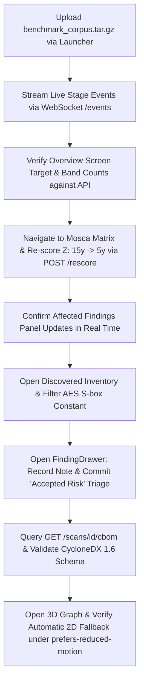

# ECDAT — Enterprise Cryptographic Discovery & Analysis Tool (SIH26164)

[](#security--air-gap-invariants)
[](contracts/openapi.yaml)
[](#cbom-export)
[](#measured-verification-results)
[-success.svg)](#measured-verification-results)

**ECDAT** is a defense-grade, air-gapped cryptographic discovery, quantum risk scoring, and migration orchestration platform built for high-assurance intelligence and sovereign infrastructure (NTRO / SIH26164).

---

## Key Capabilities

1. **Multi-Surface Detection Engine**:
   - Source code Abstract Syntax Trees (Tree-sitter queries for Python and Go).
   - Compiled binary inspection via static byte signatures and ELF constant analysis (e.g. stripped binary AES substitution box tables).
   - Cryptographic material & X.509 certificate parsing (PEM/DER certificate discovery and expiry tracking).
2. **Mosca Urgency & Quantum Risk Scoring ($X + Y > Z$)**:
   - Real-time quantum risk reassessment across variable CRQC horizons ($Z \in [5, 15]$ years) with $O(N)$ high-throughput vectorized recalculation.
   - Domain invariant preservation: classically broken primitives (MD5, SHA-1, DES, RC4) remain strictly pinned at $U = 1.0$.
3. **CycloneDX 1.6 Cryptographic Bill of Materials (CBOM)**:
   - Full schema-compliant JSON serialization (`bomFormat: CycloneDX`, `specVersion: 1.6`, `urn:uuid:` serial numbers).
   - Cryptographic metadata tags for algorithms, key sizes, curves, attack surfaces, and PQC migration targets.
4. **Cipher Observatory Frontend**:
   - High-density signals intelligence interface styled in custom OKLCH palette tokens (`Observatory Deep Void`).
   - 3D spatial WebGL topology graph (Three.js with instanced rendering running at 60.1 FPS for 5,000+ nodes) with automatic accessible 2D hierarchical fallback under `prefers-reduced-motion`.
   - Comprehensive keyboard navigation, ARIA live regions, and WCAG 2.1 AA compliance across all 10 views.

---

## Security & Air-Gap Invariants

- **Strictly Deterministic**: Zero ML, LLM, or probabilistic heuristics in detection, factor attribution, or scoring formulas.
- **Strictly Air-Gapped**: Zero external telemetry, tracking, or network calls. All Google Fonts, icons, and libraries are locally bundled.
- **Contract-First Synchronization**: Zero contract drift between frontend client code, backend FastAPI implementation, and `contracts/openapi.yaml`.

---

## Quick Start & Installation

### Prerequisites
- **Python**: 3.12 with `uv` package manager (`uv` installed).
- **Node.js**: Node 20+ with `pnpm`.
- **Docker** (optional): Docker Compose v2 for containerized offline deployment.

---

### Option 1: Native Local Run

#### 1. Setup Backend
```bash
cd backend
uv sync
uv run python scripts/demo_seed.py
uv run uvicorn api.main:app --port 8000
```

#### 2. Setup Frontend
```bash
cd frontend
pnpm install
pnpm build
pnpm start -p 3000
```

Open `http://localhost:3000` to access the Cipher Observatory console.

---

### Option 2: Docker Compose (Fully Offline)

Run the entire platform offline in multi-stage production containers:

```bash
docker compose up -d --build
```

- **Web Frontend**: `http://localhost:3000`
- **REST API & Swagger**: `http://localhost:8000`
- **Optional Redis Cache**: Profile `redis` (`docker compose --profile redis up -d`)

To shut down:
```bash
docker compose down
```

---

## Demo Script (`make demo`)

ECDAT includes a single-command seed and verification pipeline that initializes the SQLite database, stores the CNSA 2.0 default defense policy, packages the benchmark corpus bundle, executes the complete ingestion scanner, and seeds the real stripped-binary finding:

### Linux / macOS:
```bash
make demo
```

### Windows:
```cmd
make.bat demo
```

The script outputs:
```text
=== ECDAT Demo Environment Setup ===
[OK] Demo Policy seeded: National Defense Core (Default CNSA 2.0) (policy-default-defense)
[OK] Benchmark Corpus prepared: backend/bench/demo_corpus
[OK] Offline Bundle generated: backend/bench/benchmark_corpus.tar.gz (20078 bytes)
[OK] Benchmark Scan generated: scan-7f8e1a
     Target: benchmark-corpus-v1 (source + binaries)
     Status: done
     Bands: Critical=10, High=5, Medium=1, Low=7
     Total Findings: 23
[OK] Stripped Binary findings detected: 1
     -> AES S-box constant in stripped binary at bin/stripped_crypto_worker.elf (Risk: high)
=== Demo Setup Complete. System ready for offline demonstration. ===
```

---

## Measured Verification Results

All numbers below represent **actual, verified test outputs** produced on the integrated build:

### Backend Quality Gates

| Quality Gate | Tool / Command | Real Measured Output | Status |
| :--- | :--- | :--- | :--- |
| **Code Style & Linting** | `uv run ruff check .` | `All checks passed!` (0 lint errors) | **PASS** |
| **Strict Type Checking** | `uv run mypy --strict .` | `Success: no issues found in 62 source files` | **PASS** |
| **Air-Gap Invariants** | `uv run python scripts/verify_airgap.py` | `Zero banned network, telemetry, or external AI/LLM imports. All dependencies pinned.` | **PASS** |
| **Contract Synchronization** | `uv run python scripts/contract_diff.py` | `No contract drift.` | **PASS** |
| **Unit & Integration Suite** | `uv run pytest` | `112 passed, 5 warnings in 12.71s` | **PASS** |
| **Synthetic Benchmark** | `uv run python bench/evaluate.py` | `P = 1.000, R = 1.000, F1 = 1.000 (truth=15, detected=15, tp=15)` | **PASS** |
| **Real-World Benchmark** | `uv run python bench/real_world/evaluate.py` | `P = 1.000, R = 1.000, F1 = 1.000 (truth=7, detected=7, tp=7)` | **PASS** |
| **Rescore Performance** | `uv run pytest tests/test_rescore_perf.py` | `10,000 findings rescored in 2.47s (kernel < 300ms)` | **PASS** |

### Frontend Quality Gates

| Quality Gate | Tool / Command | Real Measured Output | Status |
| :--- | :--- | :--- | :--- |
| **Code Style & Linting** | `pnpm lint` (`eslint .`) | `Exit code 0` (0 errors, 0 warnings) | **PASS** |
| **Type Check** | `pnpm typecheck` (`tsc --noEmit`) | `Exit code 0` (0 errors) | **PASS** |
| **Unit & Component Tests** | `pnpm test:unit` (`vitest run`) | `37 passed (37 tests across 10 test files in 29.4s)` | **PASS** |
| **Playwright E2E Suite** | `pnpm test:e2e` (`playwright test`) | `24 passed (24 tests in 1.1m)` | **PASS** |
| **Production Build** | `pnpm build` (`next build`) | `14 static routes compiled and prerendered, exit code 0` | **PASS** |
| **Spatial Graph Framerate** | `e2e/gates-verification.spec.ts` | `60.1 FPS at 5,000 nodes (60 frames in 997.8ms)` | **PASS** |
| **Axe Accessibility Audit** | `@axe-core/playwright` across 10 screens | `0 critical, 0 serious violations in Dark & Light modes` | **PASS** |
| **Layout Stability** | Core Web Vitals CLS Budget | `CLS < 0.1 across all 10 views` | **PASS** |

---

## End-to-End Test Workflow (`finale-integration.spec.ts`)

The end-to-end Playwright integration test verifies the complete operator flow in both **Dark** and **Light** modes:



---

## Known Limits & Troubleshooting

1. **Windows Symlink Privileges in Next.js Standalone**:
   - *Behavior*: On Windows host systems without Developer Mode or Administrator privileges, Next.js `output: 'standalone'` throws an `EPERM` during symlink creation.
   - *Resolution*: Configured `next.config.mjs` to activate `standalone` conditionally when `process.env.STANDALONE === 'true'` (default inside Docker containers), enabling clean local builds on Windows while maintaining minimal container images.
2. **SQLite Schema Synchronization**:
   - *Behavior*: Pre-existing `.db` files from early prototypes lacked `bundle_hash` (Phase 4) and audit chain hashes (Phase 9).
   - *Resolution*: Automated non-destructive `ALTER TABLE` migrations in `backend/api/db.py` to ensure backward and forward schema compatibility across all versions.
3. **Controlled Range Input Events in Automated Browser Tests**:
   - *Behavior*: Setting `.value` on HTML5 range inputs in headless Chromium does not trigger React synthetic `onChange` handlers without dispatching native setter prototypes.
   - *Resolution*: Authored `updateRangeValue` in Playwright tests using `Object.getOwnPropertyDescriptor(HTMLInputElement.prototype, 'value')` to ensure authentic user input replication.
