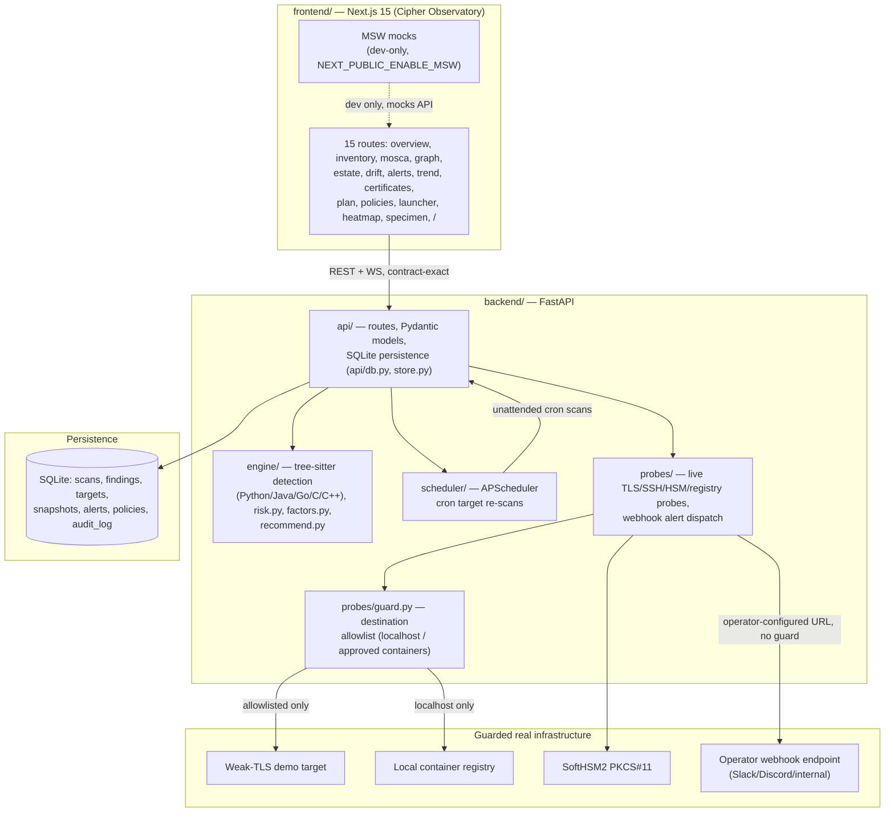

# Architecture

## Component diagram

## Data flow: a scan, end to end

1. **Trigger** — either a direct `POST /scans` (path or uploaded
   archive) or the scheduler firing a registered target's cron.
2. **Detection** (`engine/scanner.py`) — walks the target, runs
   language-specific tree-sitter queries (`engine/source_{python,java,
   go,c}.py`), emits raw `Detection` objects (family, function, key
   size/curve/mode, location).
3. **Risk scoring** (`engine/factors.py` → `engine/risk.py`) — maps each
   detection's matched `Context` (from the active `Policy`) to
   `V/F/E/K/X/Y/Z`, then applies the fixed formula
   (`Score = 100 × V×F×U×E×K`, `M = X+Y−Z`, `U` clamped and pinned to 1.0
   for classically-broken primitives). A PQC recommendation
   (`engine/recommend.py`) is attached.
4. **Persistence** (`api/store.py`) — the scan, its findings (with every
   raw factor, not just the score), and a real per-scan event log are
   written in one transaction; a `ScanSnapshotRecord` is captured for
   drift comparison if this scan belongs to a registered target.
5. **Drift** (`api/store.py`'s `calculate_drift`) — compares this
   snapshot's findings against the target's previous one by a stable
   identity tuple (path, line, family, function, symbol, key size,
   curve) — see [`docs/decisions/INDEX.md`](decisions/INDEX.md)'s
   detection-engine section for why `location.line` had to be added to
   that tuple.
6. **Alerts** (`api/alerts/rules.py` → `api/alerts/dispatcher.py`) — new
   critical findings, expiring certs, critical drift, and probe
   downgrades are evaluated and persisted; a configured
   `ALERT_WEBHOOK_URL` gets a real, fail-closed delivery.
7. **Frontend** — every screen queries the real API (MSW only in local
   dev), rendering findings, the estate graph, drift, and alerts from
   what was actually persisted.

## Module boundaries and ownership

Historically split across two build tracks that merged onto `main`;
still useful as a guide to where a change belongs.

| Path | Owns | Notes |
| :--- | :--- | :--- |
| `backend/engine/` | Detection engine, per-language queries, risk formula factor derivation | Precision floor 0.95 enforced in CI on `bench/` |
| `backend/bench/` | Fixture + real-world HOLD corpora, `evaluate.py` | Label-before-running discipline; see [`BENCHMARK.md`](BENCHMARK.md) |
| `.github/workflows/` | CI: backend gates, contract drift, precision-floor gate, reusable scan Action | |
| `backend/api/` | Routes, Pydantic models, SQLite persistence, alerts, targets/scheduler wiring | Contract-exact against `contracts/openapi.yaml` |
| `backend/probes/` | Live TLS/SSH/HSM/registry probes, webhook dispatch | The only backend surface allowed real outbound network calls, and only via `probes/guard.py`'s allowlist (or the documented `webhook.py` exception — see [ADR 016](decisions/backend/016-security-hardening.md)) |
| `backend/scheduler/` | APScheduler cron engine | No network calls of its own |
| `frontend/` | Next.js UI, 15 routes, MSW dev mocks | Never reimplements the risk formula — always renders server-computed values |
| `contracts/` | `openapi.yaml` (source of truth) + `CHANGELOG.md` | Any change is its own `contract:` commit, followed same-cycle by frontend type regeneration |
| `docs/decisions/` | ADRs, one per non-trivial or debt-accepting decision | See [`INDEX.md`](decisions/INDEX.md) |

## Why air-gapped, and how it's enforced

Detection and scoring are deterministic (no ML/LLM in the decision path)
and the runtime makes zero external calls outside `probes/`'s guarded,
operator-configured surface. `backend/scripts/verify_airgap.py` AST-scans
`api/`, `engine/`, and `scheduler/` for banned or network-capable imports
(zero tolerance) and `probes/` for network-capable imports used without
`probes.guard`'s destination check (or an explicit, documented
exception). See [`SECURITY.md`](SECURITY.md) for the threat model this
supports.
